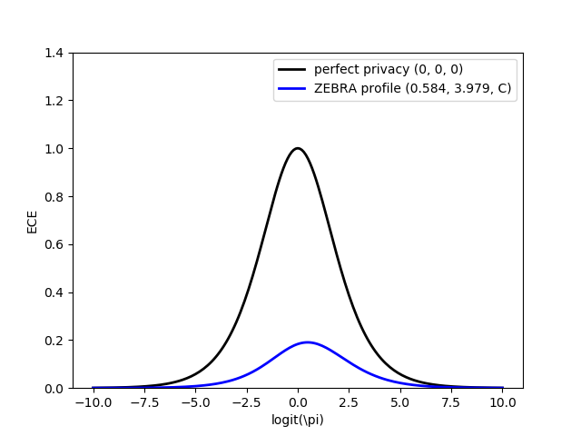

# ZEBRA: Zero Evidence Biometric Recognition Assessment
license: LGPLv3 - please reference our paper<br/>
version: 2020-06-11 <br/>
<i>author: Andreas Nautsch (EURECOM)</i>
<br/><br/>

```
Disclaimer - this toolkit is a standalone implementation of our paper

Nautsch, Patino, Tomashenko, Yamagishi, Noe, Bonastre, Todisco and Evans:
"The Privacy ZEBRA: Zero Evidence Biometric Recognition Assessment"
in Proc. Interspeech 2020
```
[[Online] pre-print](https://arxiv.org/pdf/2005.09413.pdf)

This work is academic (non-for-profit); <br/> a reference implementation without warranty.

## What is the ZEBRA framework?
_How can we assess for privacy preservation in the processing of human signals, such as speech data?_

> Mounting privacy legislation calls for the preservation of privacy in speech technology, though solutions are gravely lacking. While evaluation campaigns are long-proven tools to drive progress, the need to consider a privacy adversary implies that traditional approaches to evaluation must be adapted to the assessment of privacy and privacy preservation solutions. This paper presents the first step in this direction: metrics.

We propose the ZEBRA framework which is inspired by forensic science.

On the contrary to method validation in _modern cryptography_, which is backboned by `zero-knowledge` proofs (see Shanon), we need to tackle `zero-evidence`. The former **defines** input data (e.g., an _A_ is represented by the number _65_); the latter **models** input data (we can only _describe_ e.g., acoustic data, biometric identities, and semantic meaning). 

> Communication is more than the written word; we need to leave the stiff perspective of the written word behind, when the medium changes to speech and to other human signals (e.g., video surveillance). 

### Privacy preservation for human data is not binary
Only levels of privacy preservation can be quantified _(theoretic proofs for a yes/no decision are unavailble)_. 

The ZEBRA framework compares candidate privacy safeguards in an after-the-fact evaluation:  
* candidate algorithms protect human signals (e.g., speech) regarding the disclosure of specific sensitive information (e.g., the biometric identity);
* knowing the facts of how much sensitive information could be exposed, how much is exposed after using each candidate safeguard?

### Privacy & the realm of the adversary
The conventional signal processing or machine learning perspectives as system evaluators does not suffice anymore!

> **Adversaries are evaluators _of safeguard evaluators_.**

We need to shift our perspective.
> To optimize algorithms and their parameters, we are used to improve some average/expected performance loss.

1. Expectation values reflect on a _population level_, yet, **privacy is a fundamental human right** that is: _for each individual_ - how badly is information disclosed for those who belong to a minority in the eyes of a candidate privacy safeguard? 
2. An adversary can only _infer_ information based on observations - figuratively speaking like a judge/jury assesses evidence.
3. By formalizing _decision inference based on evidence_, the `strength of evidence` is estimated - it allows to reflect to which extent one of two decisions should be favored over another; given the circumstances of a case - an **individual performance**.
4. _Given the circumstances_ is formalized by the `prior belief`; like forensic practitioners cannot know the _prior belief_ of a judge/jury, we cannot know the _prior belief_ of an adversary.
5. Empirical Cross-Entropy (ECE) plots are introduced in forensic voice biometrics to simulate ECE for all possible _prior beliefs_, such that one can report an expected gain in relative information - an **average/expected performance**.
6. **Categorical tags** are introduced in forensic science and constantly refined since the 1960s to summarize different levels of `strength of evidence` into a _scale_ that is easier to digest by the human mind.

### ZEBRA, a _zero-evidence_ framework to assess for preserving privacy on empirical data 
The proposed ZEBRA framework has two metrics:
* on the _population level_, the expected ECE is quantified by integrating out all possible prior beliefs; the result is: `expected empirical cross-entropy [in bits]` which is `0 bit` for full privacy; and `1/log(4) ~ 0.721 bit` for no privacy.
* on the _individual level_, the worst-case strength of evidence is quantified. In forensic science, the strength of evidence is referred to a so-called log-likelihood ratio (LLR) which symmetrically encodes the relative strength of evidence of one possible decision outcome over the other; an LLR of `0 means zero strength of evidence for either possible deicision outcome` - on the contrary, `values towards inifnity would resembe towards 'inifnitely decisive' evidence` (no privacy). The worst-case strength of evidence is the `maximum(absolute(LLR))`.

> **Categorical tags** summarizes the maximum(absolute(LLR)) value; an example adopted from the literature:

| Tag | Description (for a 50:50 prior belief) |
|:----|:---------------------------------------|
|  0  | 50:50 decision making of the adversary        | 
|  A  | adversary makes better decisions than 50:50 |
|  B  | adversary makes 1 wrong decision out of 10 to 100 |
|  C  | adversary makes 1 wrong decision out of 100 to 1000 |
|  D  | adversary makes 1 wrong decision out of 1000 to 100.000 |
|  E  | adversary makes 1 wrong decision out of 100.000 to 1.000.000 |
|  F  | adversary makes 1 wrong decision in at least 1.000.000 |

> The better an adversary can make decisions, despite the privacy preservation of a candidate safeguard applied, the worse is the categorical tag.

## Scope of this ZEBRA reference implementation
1. Computation and visualization of the ZEBRA framework.<br/>
   * Metrics in ZEBRA profile: _(population, individual, tag)_ <br/> 
   * ZEBRA profile in ECE plots <br/> full privacy: `black profile` <br/> no privacy: `y = 0 (profiles equal to the x-axis)` <br/>
   
   > For display only, LLRs are in base 10.
2. Saving to: `LaTeX`, `PDF` and `PNG` formats.

3. Automatic assessment of the 2020 VoicePrivacy Challenge
  <br/> [ReadMe: use ZEBRA for kaldi experiments](voiceprivacy-challenge-2020/Readme.md)

4. Computation and visualizations of conventional metrics:
   <br/> [ReadMe: conventional plots & metrics](prior-log-odds-plots/Readme.md)
   * ECE plots (Ramos et al.) 
     <br/> metrics: _ECE & min ECE_
   * APE plots (Brümmer et al.) 
     <br/>
     metrics: _DCF & min DCF_
   * Computation only 
     <br/> metrics: _Cllr, min Cllr & ROCCH-EER_


## Installation
The installation uses **Miniconda**, which creates Python environments into a folder structure on your hard drive. 
> Deinstallation is easy: delete the miniconda folder.

1. install miniconda, see: <br/>
    https://docs.conda.io/projects/conda/en/latest/user-guide/install/#regular-installation
2. create a Python environment
    >  conda create python=3.7 --name zebra -y
3. activate the environment
    > conda activate zebra
4. installing required packages
    > conda install -y numpy pandas matplotlib seaborn tabulate


## HowTo: use
A quick reference guide for using Python, the command line and to customization.

### Command line: metric computation
Computing the metrics (command structure):
```
python zero_evidence.py -s [SCORE_FILE] -k [KEY_FILE]
```

An example is provided with `scores.txt` and `key.txt` as score and key files:
```
scr=exp/Baseline/primary/results-2020-05-10-14-29-38/ASV-libri_test_enrolls-libri_test_trials_f/scores
key=keys-voiceprivacy-2020/libri_test_trials_f

python zero_evidence.py -s $scr -k $key
```
Result:
> ZEBRA profile <br/>
Population: 0.584 bit <br/>
Individual: 3.979 (C)


### Command line: visualization
Display each plot: `-p` option:
    ```
    python zero_evidence.py -s $scr -k $key -p
    ```

### Command line: customization
1. Custom label for an experiment: `-l` option:
    ```
    python zero_evidence.py -s $scr -k $key -l "libri speech, primary baseline"
    ```
    > libri speech, primary baseline <br/>
      Population: 0.584 bit <br/>
      Individual: 3.979 (C)

2. Save the profile visualization (without their display): `-e png` <br/>
   ```
   python zero_evidence.py -s $scr -k $key -l "profile" -e png
   ```
   > `-l profile` for a file name: _ZEBRA-profile_ <br/>
   > note: _"ZEBRA-"_ is an automatic prefix to the exported plot file names
   
   _Supported file types:_
   * `-e tex`: LaTeX
   * `-e pdf`: PDF
   * `-e png`: PNG

3. To save a plot with its display, use both options: `-p -e png` <br/>
   

### Python: high-level implementation
Calling the API provided by `zebra.py`
```
from zebra import PriorLogOddsPlots, zebra_framework, export_zebra_framework_plots

# initialize the ZEBRA framework 
zebra_plot = PriorLogOddsPlots()  

# declare score & key paths
scr = 'exp/Baseline/primary/results-2020-05-10-14-29-38/ASV-libri_test_enrolls-libri_test_trials_f/scores'
key = 'keys-voiceprivacy-2020/libri_test_trials_f'

# run the framework
zebra_framework(plo_plot=zebra_plot, scr_path=scr, key_path=key)

# saving the ZEBRA plot
export_zebra_framework_plots(plo_plot=zebra_plot, filename='my-experiment', save_plot_ext='png')
```

### Python: low-level implementation
Code snippets from `zebra.py`
>Let's assume `classA_scores` & `classB_scores` are numpy arrays of scores.
```
from numpy import log, abs, hstack, argwhere
from zebra import PriorLogOddsPlots

zebra_plot = PriorLogOddsPlots(classA_scores, classB_scores)

# population metric
dece = zebra_plot.get_delta_ECE()

# individual metric
max_abs_LLR = abs(hstack((plo_plot.classA_llr_laplace, plo_plot.classB_llr_laplace))).max()

# categorical tag
max_abs_LLR_base10 = max_abs_LLR / log(10)
cat_idx = argwhere((cat_ranges < max_abs_LLR_base10).sum(1) == 1).squeeze()
cat_tag = list(categorical_tags.keys())[cat_idx]

# nicely formatted string representations
str_dece = ('%.3f' if dece >= 5e-4 else '%.e') % dece
str_max_abs_llr = ('%.3f' if max_abs_LLR >= 5e-4 else '%.e') % max_abs_LLR

if dece == 0:
    str_dece = '0'

if max_abs_LLR == 0:
    str_max_abs_llr = '0'
```

> For getting the _privacy_ related version on DCF plots, simply run: `zebra_plot.get_delta_DCF()`.

### Python: on changing categorical tags
1. Make a copy of `zebra.py`
2. Edit the following part to your liking
    > the arrays such as `array([0, eps])` contain lower and upper bounds; 
      for numerical convenience only, an epsilon value is used. <br/>
      The limits are in base-10 LLR intervals.
    ```
    # Here are our categorical tags, inspired by the ENFSI sacle on the stength of evidence
    # Please feel free to try out your own scale as well :)
    # dict: { TAG : [min max] value of base10 LLRs }
    categorical_tags = {
        '0': array([0, eps]),
        'A': array([eps, 1]),
        'B': array([1, 2]),
        'C': array([2, 4]),
        'D': array([4, 5]),
        'E': array([5, 6]),
        'F': array([6, inf])
    }
    
    # pre-computation for easier later use
    cat_ranges = vstack(list(categorical_tags.values()))
    ```

## Documentation

This package is based on:
* [ECE plot](http://arantxa.ii.uam.es/~dramos/files/2009_09_02_ECE_plots_SW.zip)
* [pyBOSARIS](https://gitlab.eurecom.fr/nautsch/pybosaris)
* [cllr](https://gitlab.eurecom.fr/nautsch/cllr)
* [sidekit](https://git-lium.univ-lemans.fr/Larcher/sidekit)
* [BOSARIS toolkit](https://sites.google.com/site/bosaristoolkit/)
* [Verbal Detection Error Tradeoff plot](https://ieeexplore.ieee.org/document/8025342/algorithms?tabFilter=code#algorithms)

In `performance.py`, one can find derived and adjusted code snippets.


For legacy compatability, the code is structured to also provide DCF and ECE visualizations.

> Naturally, Cllr, min Cllr and the ROCCH-EER can also be computed with the ZEBRA toolkit. For optimization, please see pyBOSARIS; eventually, to optimize ZEBRA, we would recommend to optimize Cllr. (see [Niko Brümmer's disseration](https://scholar.sun.ac.za/handle/10019.1/5139) or the [BOSARIS toolkit user guide](https://docs.google.com/viewer?a=v&pid=sites&srcid=ZGVmYXVsdGRvbWFpbnxib3NhcmlzdG9vbGtpdHxneDozOTEwZjAzZmM3ZThmNjE0) regarding _convexity_).

This toolkit is organized as follows:
* `demo_conventional_plots.py`
  <br/>
  Creation of conventional ECE & APE plots
* `demo_voiceprivacy_challenge.py`
  <br/>
  Automatic ZEBRA evaluation of an entire challenge
* `demo_zebra.py`
  <br/>
  Example on creating a ZEBRA plot and exporting to tex, pdf, png
* `helpers.py`
  <br/>
  Helpers to read score files from the kaldi folder structure
* `performance.py`
  <br/>
  Library of integrated performance functions, see related software
* `plo_plots.py`
  <br/>
  Implementation of ECE & APE plots in one class: `PriorLogOddsPlots`; with plot export functionality
* `zebra.py`
  <br/>
  Wrapper functions to interact with `PriorLogOddsPlots` in ZEBRA style
* `zero_evidence.py`
  <br/>
  Command line script for ZEBRA framework

---

_Acknowledgements_
> This work is partly funded by the projects: ANR-JST VoicePersonae, ANR Harpocrates and ANR-DFG RESPECT.
