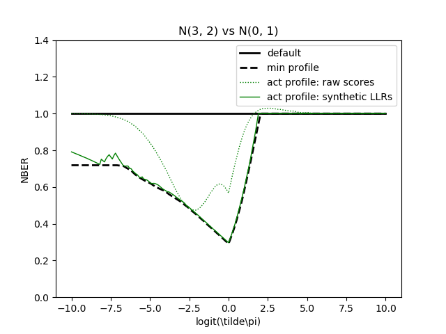

## Prior Log-Odds Plots for conventional plots & metrics
The `PriorLogOddsPlots` class is the heart of this toolkit, and supports the plots & metrics it is based on.
Regarding visualizations, namely:

1. Applied probability of error (APE) plots; referred to _DCF plots_ <br/>
    see: [BOSARIS toolkit](https://sites.google.com/site/bosaristoolkit/) _(Matlab implementation)_ <br/>
   
2. Empirical cross-entropy (ECE) plots; referred to _ECE plots_<br/>
    see: [ECE plot](http://arantxa.ii.uam.es/~dramos/files/2009_09_02_ECE_plots_SW.zip) _(Matlab implementation)_ <br/>
   

### Set-up of a synthetic scores example 
```
# setup for this example
from numpy.random import randn
from zebra import PriorLogOddsPlots

# synthetic scores inspired by BOSARIS toolkit
classA_scores = 3 + 2 * randn(10**5)
classB_scores = randn(10**5)

plo_plot = PriorLogOddsPlots(classA_scores, classB_scores)
```
These synthestic scores before calibration (dotted actual profile): <br/>
<br/>
and after calibration (solid actual profile):<br/>


> Both histograms have the same EER.

### Visualizations
1. Initialization of a `plo_plot` object
    > The main idea is simple:<br/>
      `plo_plot = PriorLogOddsPlots(classA_scores, classB_scores)`<br/><br/>
      yet, there are also some parameters to explain:
   ```
   # let's say scr handles all scores of an experiment & key handles their ground-truth
   classA_scores = scr.values[key.values == True]
   classB_scores = scr.values[key.values == False]
   
   # normalization: dividing y-values of profiles by the default value
   # -> y-values of default will equal "1" (resemble a line)
   # -> visual distances (vertical) are made comparable to the human eye
   # makes APE plots to "Normalized Bayesian Error Rate (NBER)" plots
   # and ECE plots to "Normalized ECE (NECE)" plots
   # normalize = False  # then it is: APE plot & ECE/ZEBRA plot
   # normalize = True   # or: NBER plot & NECE plot/normalized ZEBRA plot
   normalize = False
   
   # resolution of prior log-odds to run the visual assessment for
   # the metric computation is analytical (does not consider: plo)
   plo = linspace(-10, 10, 201)
   
   # the plot object
   plo_plot = PriorLogOddsPlots(classA_scores, classB_scores, normalize=normalize, plo)
   
   # plo_plot will automatically prepare the class A/B scores for assessment
   # this can take a while  
   ```
2. Putting a new system - particularly, its class A & class B scores - to assessment
   ```
   # let's say there is a contrastive system with scores:
   # classA_scores_constrastive
   # classB_scores_constrastive
   
   # to set a new system within the same plot object
   plo_plot.set_system(classA_scores_constrastive, classB_scores_constrastive)
   
   # as above, the plo_plot object will take time to prepare assessment and visualization 
   ```
3. Conventional DCF plots
   ```
   # plot parameters
   
   # visualization of minimum profile (class discrimination performance)
   # color_min = None  # disable profile visualization
   color_min = 'k'
   style_min = '--'
   
   # visualization of actual profile (class discrimination & calibration performance)
   # color_act = None  # disable profile visualization
   color_act = 'g'
   style_act = '-'
   
   # the DCF plot
   plo_plot.plot_dcf(color_min=color_min, style_min=style_min, color_act=color_act, style_act=style_act)
   
   # each plo_plot creates its unique figure handle for DCF plots, see
   # self.dcf_fig = 'DCF-' + uuid
   ```
   
   > normalized y-axis:<br/>
   
   > Observation: synthetic LLRs are almost but not ideally calibrated.

4. Conventional ECE plots
   ```
   # plot parameters
   
   color_min = 'b'
   style_min = '--'
   
   color_act = 'r'
   style_act = '-'
   
   # the ECE plot
   plo_plot.plot_ece(color_min=color_min, style_min=style_min, color_act=color_act, style_act=style_act)
   
   # to create a new plot canvas, just create a new plo_plot object:
   # plo_plot_empty_canvas = PriorLogOddsPlots()
   ```
   
   > normalized y-axis:<br/>
   
    
5. Exporting plots
   ```
   # where the plot should be stored
   filename = 'my_experiment'
   
   # file extension to export to
   # ext = 'tex'  # to LaTeX
   # ext = 'pdf   # to PDF
   ext = 'png'  # to PNG
      
   # exporting DCF plot
   plo_plot.save(filename, 'DCF', ext)
   
   # exporting ECE plot
   plo_plot.save(filename, 'ECE', ext)
   
   # 'DCF-' and 'ECE-' qualifiers will also be added automatically to the filename, e.g.:
   # DCF-my_experiment.png
   # ECE-my_experiment.tex
   ```
### Legend customization
Legends are shown for each plot type, if made explicit:
```
# show legend for DCF plots
plo_plot = show_legend(plot_type='DCF')

# show legend for ECE plots
plo_plot = show_legend(plot_type='ECE')
```

Legend positioning is possible by a `str` and a `callable` argument:
```
# conventional positioning by string, see:
# https://matplotlib.org/3.2.1/api/_as_gen/matplotlib.pyplot.legend.html
plo_plot = show_legend(plot_type='ECE', legend_loc='upper left')
``` 

For placing a legend outside of the plot, we need to rescale the figure and place the legend in the new space.
> This course is not always easy and straightforward to implement, thus `partial` functions are used. Users are free to implement their location placings.

Example `callable` legend function, see `helpers.py`:
```
# Shrink current axis by 20%, see: 
# https://stackoverflow.com/questions/4700614/how-to-put-the-legend-out-of-the-plot
def place_legend(figure, legend, shrink=0.2):
    ax = mpl.figure(figure).get_axes()[0]
    box = ax.get_position()
    ax.set_position([box.x0, box.y0 + box.height * shrink/2, box.width, box.height * (1 - shrink/2)])
    ax.legend(legend, loc='upper center', bbox_to_anchor=(0.5, -0.1-shrink/4), fancybox=True, shadow=True, ncol=2)
```

It is simply called by:
```
from functools import partial


legend_loc = partial(place_legend, shrink=1.2)
plo_plot.show_legend(plot_type='ECE', legend_loc=legend_loc)
```
> The partial arguments are `figure` and `legend`; these arguments are used as interface in the `plo_plot` function: `show_legend`. 
> Internally, this interface call is handled as: <br/> `legend_loc(figure=figure, legend=legend)`

### Computation of Cllr, min Cllr & ROCCH-EER
These well-established metrics can be either read-off from DCF/ECE plots or are their integrals. A quick reference on how to compute them fast from a `plo_plot` object:

* Cllr & min Cllr
  ```
  from performance import cllr
  
  # if scores are LLRs, their Cllr value is optimal (at its minimum)
  # when setting class A/B scores, the `plo_plot` object calibrates them once
  actual_cllr = cllr(plo_plot.classA_scores, plo_plot.classB_scores)
  min_cllr = cllr(plo_plot.classA_llr, plo_plot.classB_llr)
  
  # this oracle calibration is a one time effort
  # thus, visualization and metric computation are not calibrating scores twice
  ```
  > Cllr is the integral of DCF values in APE plots.<br/>
  > min Cllr is integral of min DCF values in APE plots.<br/><br/>
  > In N/ECE plots, Cllr is read-off the red profile at x=0. <br/>
  > In N/ECE plots, min Cllr is read-off the blue profile at x=0. 
* ROCCH-EER
  ```
  # exact result after PAV-LLR algorithm; ROCCH computation
  rocch_eer = plot_plot.rocch_eer
  
  # EER estimate as max min DCF; precision depends on plo parameter
  eer = plot_plot.eer
  ```
  > The ROCCH-EER is the maximum of all min DCF values (see BOSARIS toolkit user guide); it is computed after score calibration - it's fast when all min DCF values are known already.<br/>
  

* To find a specific ECE or DCF value:
  > let's say we don't need to interpolate and the plo exists
    ```
    from numpy import log, linspace, round, argwhere
    
    # set-up
    plo = linspace(-10, 10, 201)  # 201 gives a "0.1" precision for a prior; 2001 gives a "0.01" precision
    prior = round(-log(99), 1)  # NIST SRE'10 prior, as an example; rounded to "0.1" precision
    idx = argwhere(prior == plo)[0]
    
    # DCF
    def_dcf = plo_plot.defDCF[idx]  # ~ 0.010
    min_dcf = plo_plot.minDCF[idx]  # ~ 0.006
    act_dcf = plo_plot.actDCF[idx]  # ~ 0.008
    
    # for values on normalized y-axis:
    def_dcf / def_dcf  # 1.000
    min_dcf / def_dcf  # ~ 0.605
    act_dcf / def_dcf  # ~ 0.790
    
    # ECE
    def_ece = plo_plot.defECE[idx]  # ~ 0.080
    min_ece = plo_plot.minECE[idx]  # ~ 0.039
    act_ece = plo_plot.actECE[idx]  # ~ 0.053
    
    # for values on normalized y-axis:
    def_ece / def_ece  # 1.000
    min_ece / def_ece  # ~ 0.490
    act_ece / def_ece  # ~ 0.656
    ```

