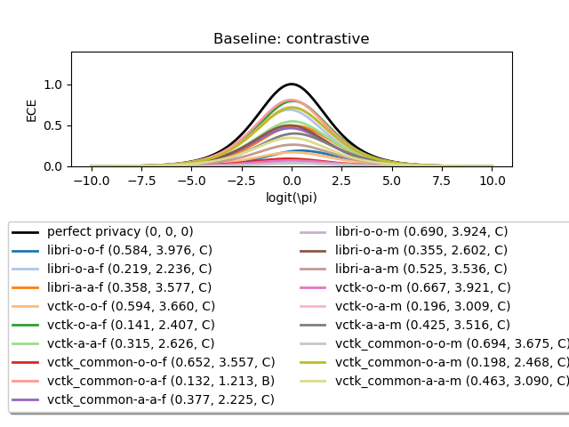
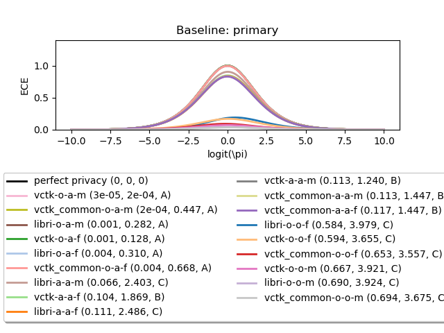
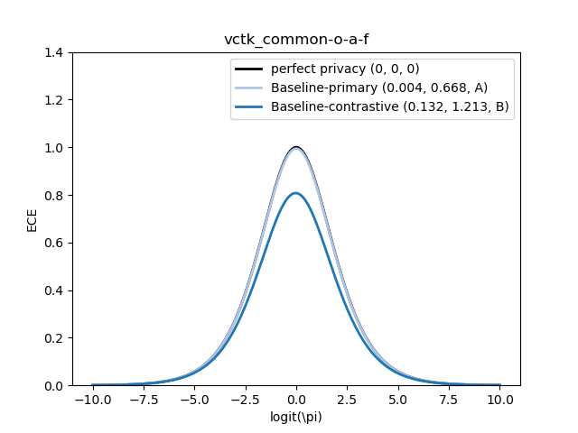
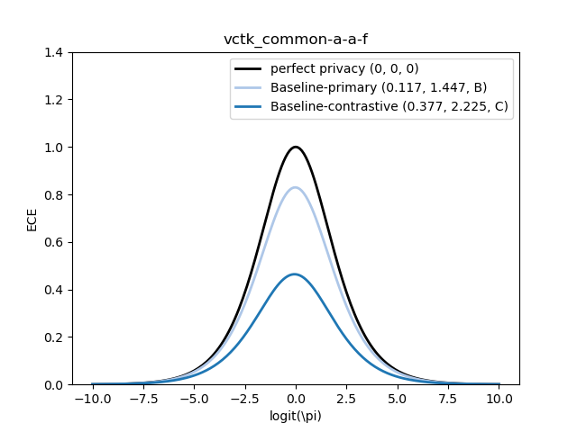
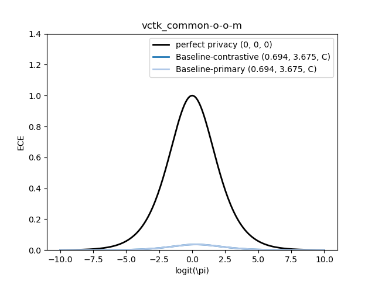
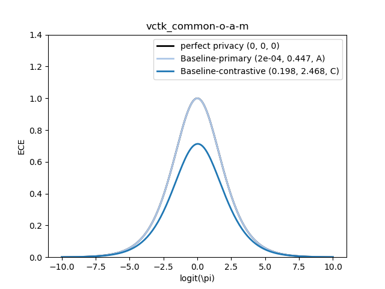
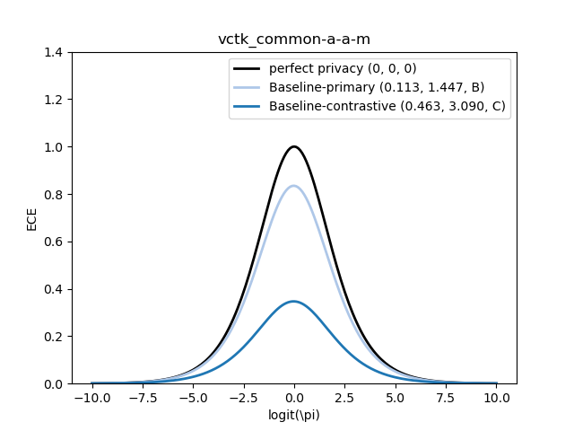

## Examples: 2020 VoicePrivacy Challenge
For _kaldi_ based experiments, like the 2020 VoicePrivacy Challenge, the code snippet `demo_voiceprivacy_challenge.py` provides an overview on:

> We assume team submissions are in the folder `exp` with subfolders `TEAM-ID/SYSTEM/results-TAG`.
> Results are shown for the primary and contrastive baseline systems.

### Computation & visualization
The [evaluation plan of the 2020 VoicePrivacy challenge](https://www.voiceprivacychallenge.org/docs/VoicePrivacy_2020_Eval_Plan_v1_3.pdf) 
covers automatic speaker verification (ASV) and automatic speech recognition (ASR).
The former quantifies the biometric privacy; the latter quantifies the non-biometric utility.
Additionally, speech naturalness and intelligibility are addressed in the challenge.

### Metrics of biometric privacy
Results are exported to:
* [Markdown table (GitLab ReadMe style)](results.md)
* [CSV table](results.csv)
* [LaTeX table](results.tex)


### Visualization with ZEBRA framework

* Comparison: **multiple** systems at **one** condition (e.g., _libri-a-a-f_)<br/>


* Comparison: **one** system at **multiple** conditions<br/>
<br/>


### Sorting legend entries
To sort legend entries, ZEBRA profiles need to be memorized first. For sorting by DECE values, list of lists strcutures are used:
```
from copy import deepcopy
from os import sep

dece_values = []
title_strings = []
zebra_objects = []
filename_strings = []

# memorize ZEBRA profiles
for single_assessment, title in zip(assessment_categories, category_titles):
    zebra_plot = PriorLogOddsPlots()
    
    # handles for later sorting
    dece_values.append([])
    dece_handle = dece_values[-1]
    zebra_objects.append([])
    zebra_handle = zebra_objects[-1]
    
    # and depending descriptions
    title_strings.append(title)
    filename_strings.append('voiceprivacy-challenge-2020' + sep + title)
    
    for scr, key, label in zip(score_paths, key_paths, profile_labels)  # conditions or systems to look into for each single assessment
        zebra_framework(zebra_plot, scr, key, label, color_min=None)  # color_min=None deactivates profile plotting; we just want to compute profiles

        # memorizing ZEBRA profiles
        dece_handle.append(zebra_plot.get_delta_ECE())
        zebra_handle.append(deepcopy(zebra_plot))
```

Then, the following function sorts DECE values, creates plots with sorted legends, and exports them:
```
zebra_plots_sorted_legend(dece_values, zebra_objects, title_strings, filename_strings)
```

<br/>


---

### Task-wise system comparison
> Grouped by databases and gender.

#### LibriSpeech: female


#### VCTK: female


#### VCTK-common: female






---

#### LibriSpeech: male


#### VCTK: male


#### VCTK-common: male







